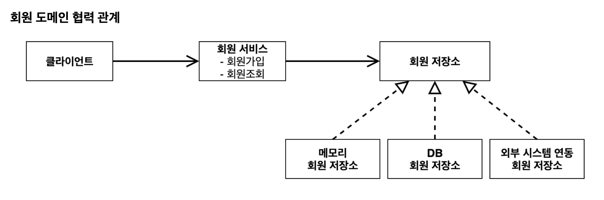
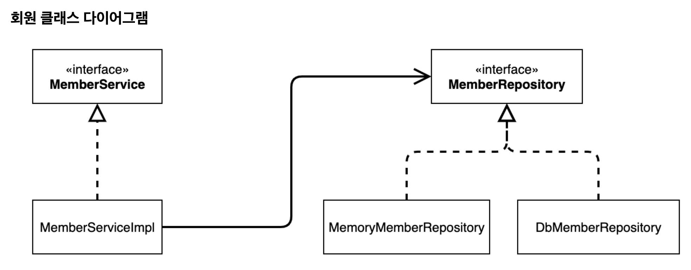
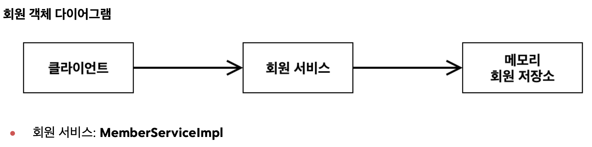

## 비즈니스 요구사항과 설계

### 회원

- 회원을 가입하고 조회할 수 있다.
- 회원은 일반과 VIP 두 가지 등급이 있다.
- 회원 데이터는 자체 DB를 구축할 수 있고, 외부 시스템과 연동할 수 있다. (미확정)

### 주문과 할인 정책

- 회원은 상품을 주문할 수 있다.
- 회원 등급에 따라 할인 정책을 적용할 수 있다.
- 할인 정책은 모든 VIP는 1,000원을 할인해주는 고정 금액 할인을 적용해달라. (나중에 변경될 수 있음)
- 할인 정책은 변경 가능성이 높다. 회사의 기본 할인 정책을 아직 정하지 못했고, 오픈 직전까지 고민을 미루고 싶다. 최악의 경우 할인을 적용하지 않을 수도 있다. (미확정)

---

위와 같은 비즈니스 요구사항이 있다고 생각하면 머리가 아플 거 같다 ,,

뭐 죄다 미확정이래.

일단 할인 정책 부분은 “할인” 메서드를 제공하는 인터페이스를 만들어서 할인 정책을 언제든지 교체할 수 있게 하면 될 거 같고

회원은 회원 데이터에 접근하는 `Repository` 인터페이스를 만들어서
자체 DB인 경우엔 JPA로 접근하고, 외부 회원 시스템인 경우 외부 API를 호출하는 식으로 하면 되지 않을까 ? 라는 생각이 든다.

---

## 회원 도메인 설계

### 회원 도메인 요구사항

- 회원을 가입하고 조회할 수 있다.
- 회원은 일반과 VIP 두 가지 등급이 있다.
- 회원 데이터는 자체 DB를 구축할 수 있고, 외부 시스템과 연동할 수 있다. (미확정)

### 회원 도메인 협력 관계

### 회원 클래스 다이어그램

### 회원 객체 다이어그램

---

예상한대로, 회원 데이터에 접근하는 `Repository` 인터페이스를 만들고,

자체 DB인 경우와 외부 회원 시스템을 사용하는 경우의 구현체를 다르게 만들어

상황에 맞게 사용하는 방향으로 가는 것 같다.
